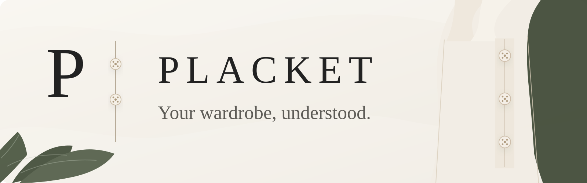

<p align="center">
  
</p>

<p align="center">
  <strong>A personal fashion app that learns your wardrobe, style preferences, fit history, and shopping habits.</strong>
</p>

## About

Placket is a personal fashion app that learns your wardrobe, style preferences, fit history, and shopping habits to help you build better outfits and make smarter clothing purchases.

The goal is to create a persistent personal fashion model that becomes more useful over time as it learns what you own, what you actually wear, what fits you well, and what kinds of clothing you tend to prefer.

## Current Status

Placket is currently in early development.

The initial focus is on building the mobile application foundation, wardrobe management, authentication, and the core data model before adding more advanced recommendation and shopping features.

## Planned Core Features

- Digital wardrobe management
- Garment photo uploads
- Outfit recommendations
- Personal style learning
- Fit memory
- Wear history and feedback
- Wardrobe insights
- Shopping Copilot
- Similar-item and duplicate detection
- Weather-aware outfit recommendations
- Personalized purchase evaluation

## Tech Stack

Placket is being built with:

- Expo
- React Native
- TypeScript
- Supabase
- PostgreSQL
- Supabase Storage
- Supabase Edge Functions
- GitHub
- Codex
- Multimodal AI APIs

The application is intended to support iOS, Android, and web from a shared codebase.

## Architecture

At a high level:

```text
Expo / React Native
        |
        v
     Supabase
   /    |     \
Auth  Postgres  Storage
        |
        v
  Edge Functions
        |
        v
     AI APIs
```

The mobile application handles the user interface.

Supabase provides authentication, database storage, image storage, and server-side functionality.

AI services are called through server-side functions rather than directly from the client so that private API keys remain secure.

## Development Approach

Placket is being developed incrementally rather than attempting to build the entire product at once.

Each major feature is intended to be built as a complete vertical slice, including:

- user interface
- database changes
- backend logic
- security
- validation
- testing

The planned build sequence is:

1. Application foundation
2. Authentication and database
3. WardrobeOS
4. Garment image analysis
5. Outfit Intelligence
6. Personal Fashion Model
7. Fit Memory
8. Shopping Copilot
9. Production hardening
10. Private beta

## Product Principles

Placket should:

- learn the user instead of forcing them into a fixed style category
- preserve accurate representations of real garments
- keep AI mostly invisible in the interface
- explain recommendations clearly
- distinguish between what users say they like and what they actually wear
- allow users to correct automated assumptions
- protect user photos and wardrobe information by default
- avoid recommending unnecessary purchases simply to drive sales

## Development

Local development instructions will be added once the initial Expo project and dependencies are in place.

## Repository Structure

The project structure will evolve as development progresses, but the repository will generally separate:

- screens
- reusable UI components
- services
- database logic
- AI integrations
- shared types
- utilities
- tests
- project documentation

Additional architecture documentation will live under `/docs`.

## Documentation

Planned internal documentation includes:

```text
/docs
  architecture.md
  database.md
  ai-system.md
  security.md
  decisions.md
  lessons-learned.md
```

These documents will explain major technical decisions and how Placket's systems work.

## Privacy and Security

Placket is intended to treat wardrobe data, fit information, and user images as private information.

Core security principles include:

- private storage by default
- row-level authorization
- no secret API keys stored in the mobile application
- validated AI responses
- user-controlled data deletion
- minimum necessary permissions
- explicit consent for third-party AI processing

## License

No public license has been selected yet.

All rights reserved while the project is under private development.
